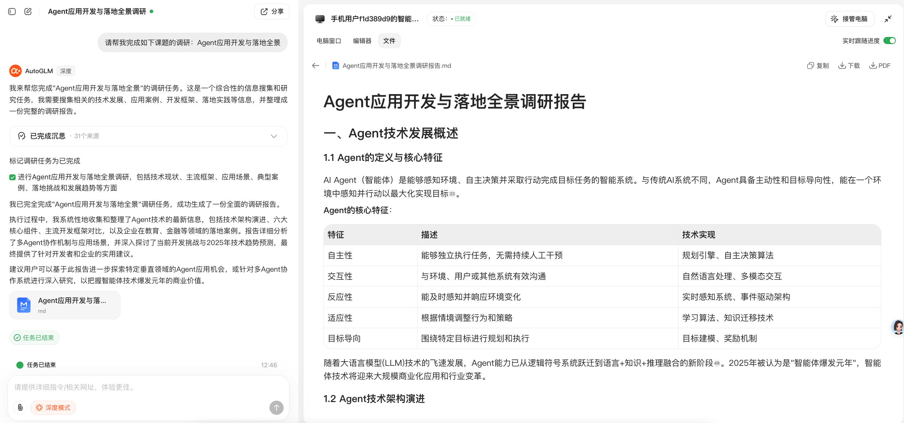
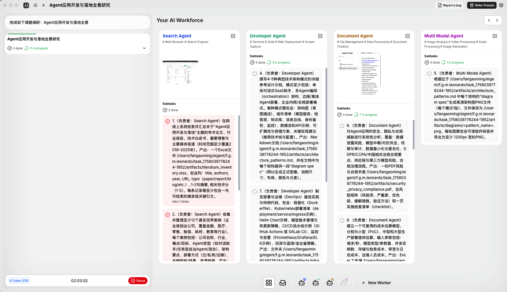
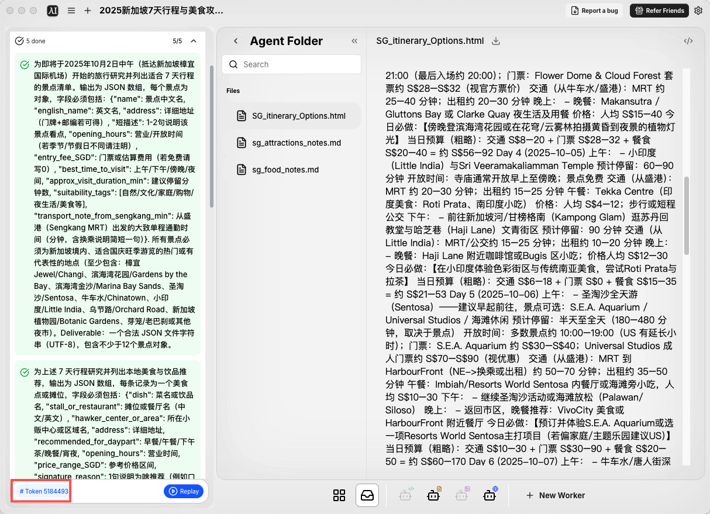

# Agent应用开发与落地全景

问题：
- 使用DeepResearch工具做《Agent应用开发与落地全景》课题的调研；
- 对感兴趣的Agent应用领域产品做盘点和理解；
- Agent应用的核心技术栈有哪些？该怎么去学习；

### 使用DeepResearch工具做《Agent应用开发与落地全景》课题的调研
使用 AutoGLM 沉思版进行调研，其调研报告 [Agent应用开发与落地全景调研报告](Agent应用开发与落地全景调研报告.md) 给出了 agent 的定义与核心特征：自主性、交互性、反应性、适应性、目标导向，文中的定义与特征描述还是很全面的，符合我对 agent 的认知。目前还没找到具有上述所有特征征的 agent 或 agent 系统。

同时，文中判断多 Agent 协作是未来趋势，给出了教育、金融领域的多智能体应用场景，如在科学实验设计中，一个Agent负责理论解释，一个Agent提供实验步骤指导，一个Agent评估实验设计合理性。这些想法总结，或许能为我打造助教类 agent 提供帮助，后续 task 中要寻找具体的教育 agent 进行体验一下。

### 对感兴趣的Agent应用领域产品做盘点和理解；
近期，对一款多 agent 系统 Eigent 感兴趣，使用相同的 prompt 进行测试，任务似乎超时或网络问题未完成。该系统构造了多个 agent 各自负责一部分内容，如 search agent 负责使用 Google 浏览器 api 搜索并获取网页内容，document agent 负责整合所有内容并输出文档总结，当然，应该还有个规划 agent 来拆解任务，并分配给对应的 agent。

重新尝试新任务，为我生成一份新加坡旅行攻略，完成度一般，但耗费百万级的token，似乎有点多，应是在搜索阶段获得了大量的内容，均输入模型进行总结。

### Agent应用的核心技术栈有哪些？该怎么去学习；
[Agent应用开发与落地全景调研报告](Agent应用开发与落地全景调研报告.md) 给出了完整的技术栈，我认为应在功能组件层、应用层发力，首先拆解目标 agent 的功能，根据功能在开发过程中试错和学习对应的技术。
| 技术层次 | 关键组件 | 核心技术/工具 |
|---------|---------|-------------|
| 基础设施层 | 计算资源管理 | GPU集群、云计算平台、容器化部署 |
| 模型服务层 | AI能力支撑 | 大语言模型、专用模型、向量数据库 |
| 数据管理层 | 数据处理与存储 | 数据采集、清洗、标注、向量存储、关系数据库 |
| 智能体框架层 | 应用开发框架 | LangChain、AutoGen、CrewAI、Agentar |
| 功能组件层 | 核心能力模块 | 感知系统、规划引擎、记忆机制、工具调用 |
| 应用层 | 行业解决方案 | 垂直领域知识模型、业务流程集成 |
| 部署运营层 | 运维与监控 | AIOps、性能评测、安全防护、可观测性 |
