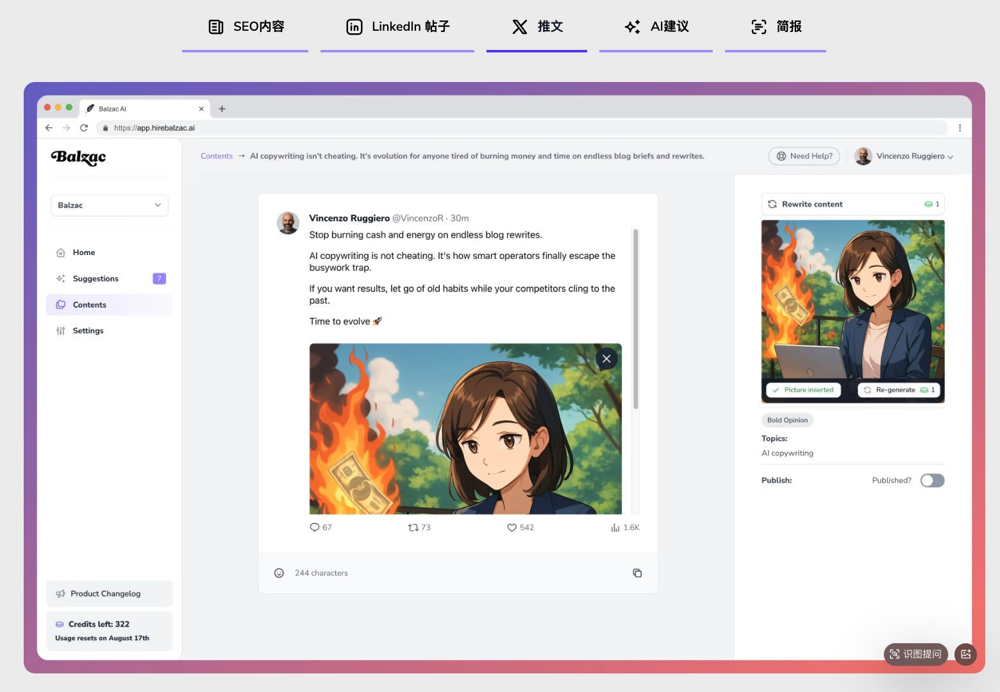
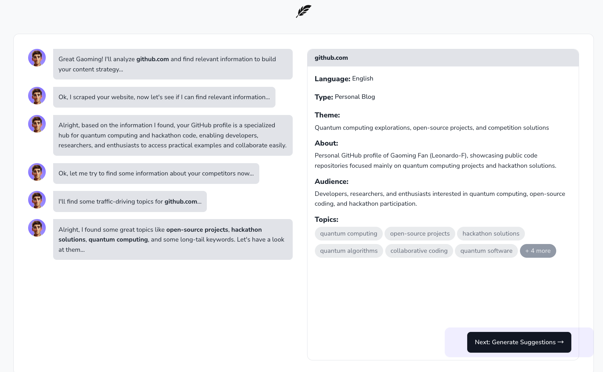
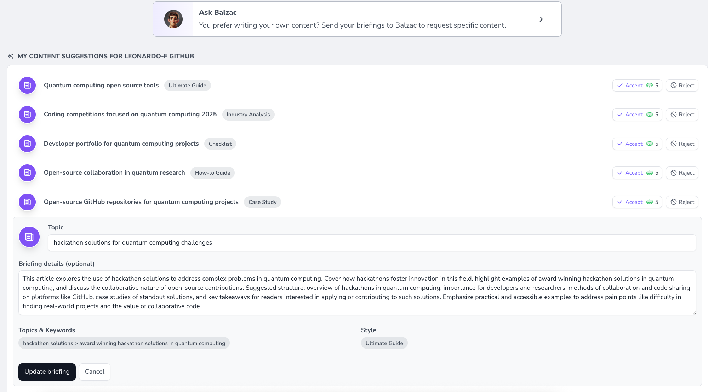
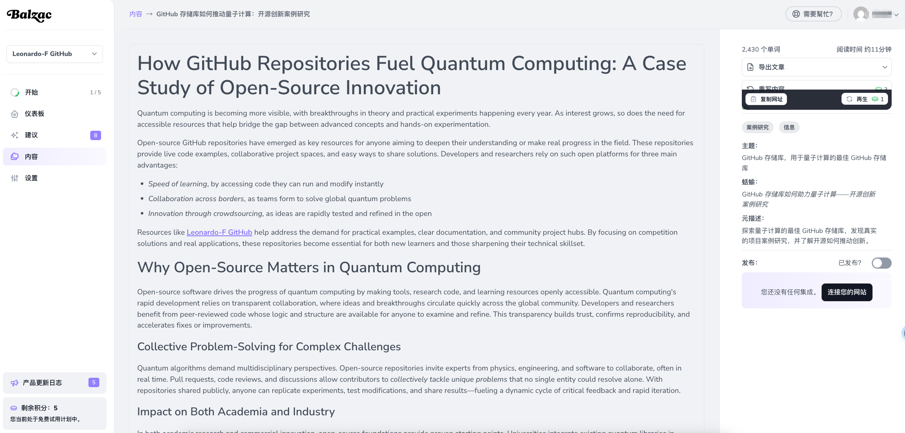

# Agent 产品拆解

以用户为中心创造产品，贯穿产品全生命周期的实践框架：
- AI产品机会发现：从搜索引擎、社交媒体等，基于 SEO 工具发现用户痛点；
- AI产品设计/开发上线：根据用户需求，基于 LLM 或工作流等构造初步 demo 或问答数据集，在测试过程中根据用户体验动态调整优化，最后上线验证；
- AI产品运营：在产品开发多初期（浅水区）绑定少量用户，持续优化，当优化到产品力足够强大时（深水区），在专用群体内使用，最后尝试扩大场景，占领市场；

## [Balzac](https://hirebalzac.ai/)

Balzac 是一款 ai 文案撰写工具，可以根据我们提供的主题撰写 blog, LinkedIn, and X (Twitter) 等社交平台等文案，

下面，基于上述的方法，尝试拆解 ai 产品

### AI产品机会发现

- 目标用户：个体创作者手 GitHub、X、Twitter 等技术或社交平台。企业用户，则是对应的营销团队或新媒体团队，推广企业活动或品牌。
- 痛点/需求：灵感枯竭，文案输出困难；无可参考案例，从想法到打磨成可发到文案，耗时较长。

### AI产品设计/开发上线

- 尝试使用博客功能，输入了 GitHub 主页，分析过往的存储库主题，给出潜在的受众，给出内容生成建议

- 自动生成一些博文概要，或用户自定义主题、文章框架等，

- 生成最终文案，并配图

### AI产品运营
- 扩大场景，延伸出来，可以是国内的小红书、微博、朋友圈文案等，给定主题和相关的照片，LLM 进行分析生成对应的文案，或给出该如何展示