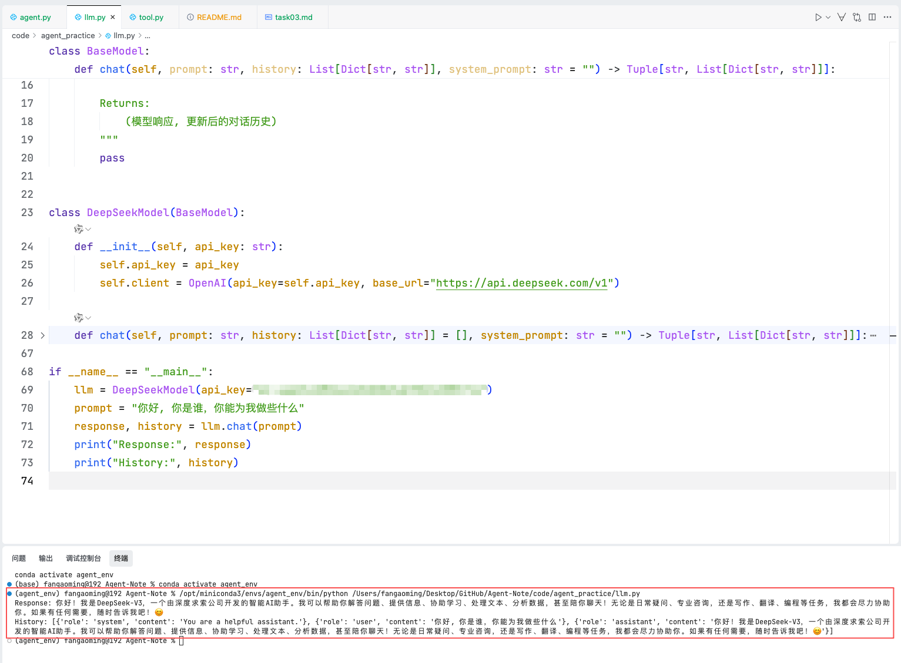

# Agent 实践

源代码参考：[动手学 Agent 应用开发示例代码](https://www.datawhale.cn/learn/content/220/5020)

ReAct 架构主要通过观察-思考-行动循环模式来实现决策：
- Thought：基于当前观察进行推理
- Action：选择并执行具体行动
- Observation：观察行动结果
- 循环：根据新观察继续思考

在本次课程实践中，我将 `llm.py` 中的 `Siliconflow` 替换成 `DeepSeekModel`，同时在`tool.py` 中添加了百度翻译模块 `baidu_translate`，尝试让 agent 搜索总结出一段文本，并翻译成英文，同时将对话记录为存为 json 文件。跑通代码后，后续再尝试调整系统提示词，进行角色扮演等尝试。

### DeepSeekModel

### Google Search  

### Baidu Translate

### Agent Test

