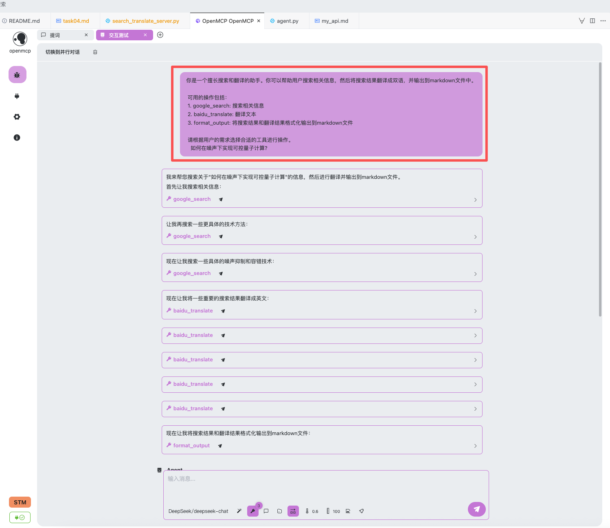
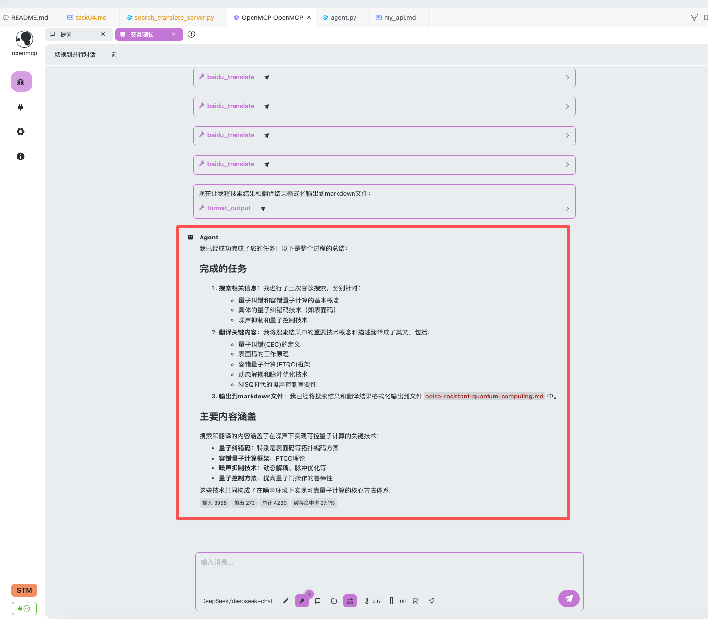

# MCP 实践

本任务基于如下源代码进行修改：[openmcp-tutorial](https://github.com/LSTM-Kirigaya/openmcp-tutorial/tree/main/word-mcp)

[Agent 实践](docs/task03/task03.md) 中，我们给大模型构造了 tools 类，描述各个工具的作用，但是当业务越复杂或 tools 种类越多时，大模型读取工具的描述信息可能会变得冗长且难以维护。这是，我们需要一种更灵活的方式来管理和调用这些工具，mcp 协议由此而来，可以更好的管理大模型的工具。在本任务中，我计划将 [Agent 实践](docs/task03/task03.md) 中的 `baidu_translate` 和 `google_search` 模块改写成 mcp 的形式(从代码上看，主要是加了装饰器`@mcp.tool()`)，尝试让 llm 搜索总结出一段文本，并翻译成英文，同时最终结果输出为 markdown 格式。

代码由 Trae 生成：[search_translate_server.py](../../code/mcp_practice/search_translate_server.py)

运行结果：[noise-resistant-quantum-computing](../../code/mcp_practice/.mcp-output/noise-resistant-quantum-computing.md)

