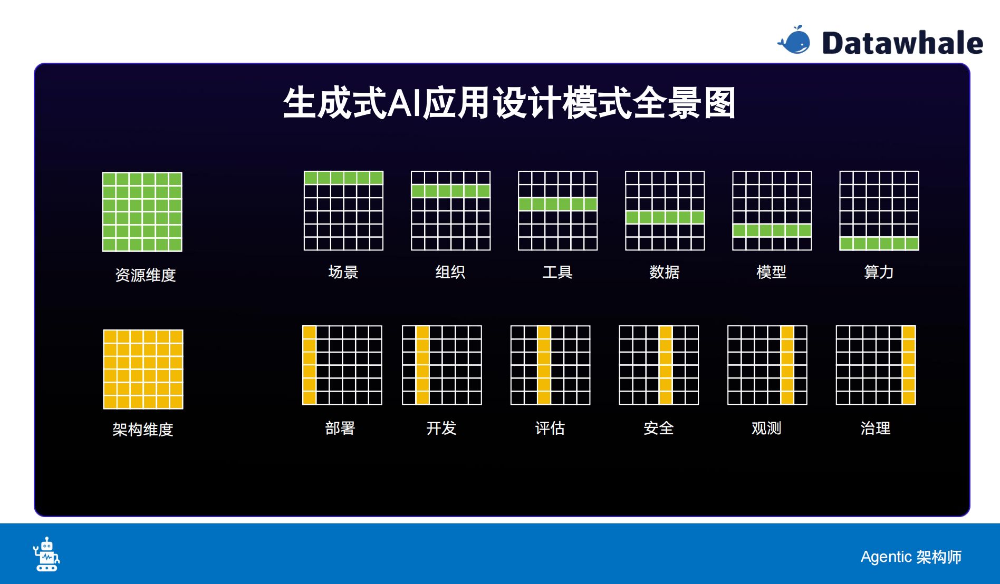
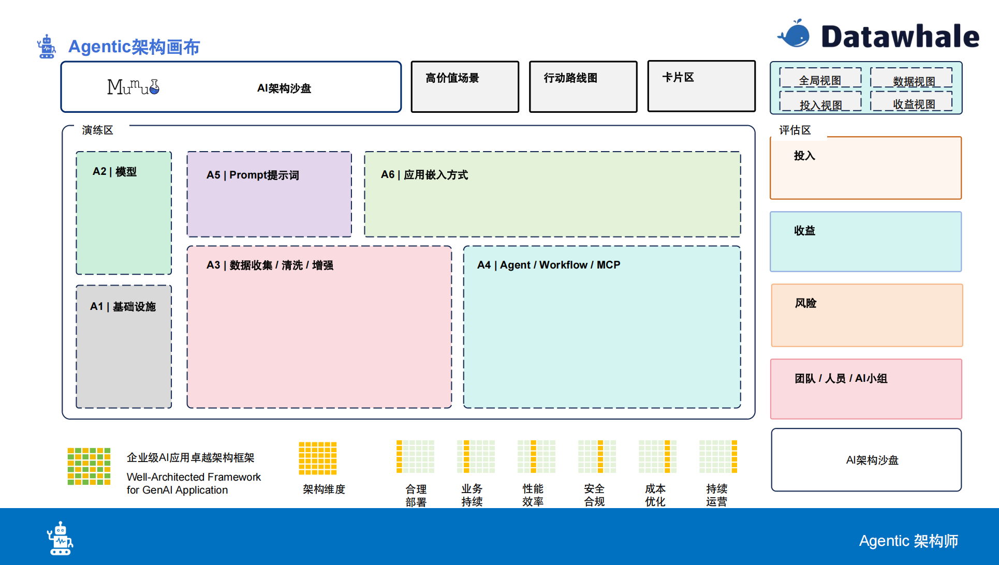

# Agent设计模式与工程化

agent 核心能力：
- planning;
- tool use;
- miming;

在设计实用的 agent 系统时，应该考虑如何组合使用 agent 的核心能力。以 chatbot 为例， 在 planning 阶段是在识别客户意图，然后在 miming 阶段是在知识库中寻在答案，在 tool use 阶段可以调用工具，如 Google search 或 Baidu translate 的 mcp 去验证答案是否正确或者翻译成中英文给对应的客户。

在给各行各业赋能 ai agent 应用时，不同行业的客户是有可能存在相同场景的，如针对用户的智能客服、针对员工的智能小助手等，这类场景的 agent 设计是基本相似的。如果从中抽象出通用的设计模式，那对于不同行业的类似的场景，是可以快速标准化展开 agent 开发的，加快 agent 应用的落地。

启发思考我的日常工作：至今参与的算法项目，大部分的数据来源（格式相同）、数据处理流程（步骤差异不大）、模型设计基本是相似的。或许可以做一个简单的 agent？将数据处理的函数、模型函数等封装成 mcp，将数据处理、模型训练、模型预测等步骤进行描述，然后新项目中，可以让 agent 快速处理一批数据，并返回结果，查看效果。

可以从以下两个维度去思考 agent 的架构

